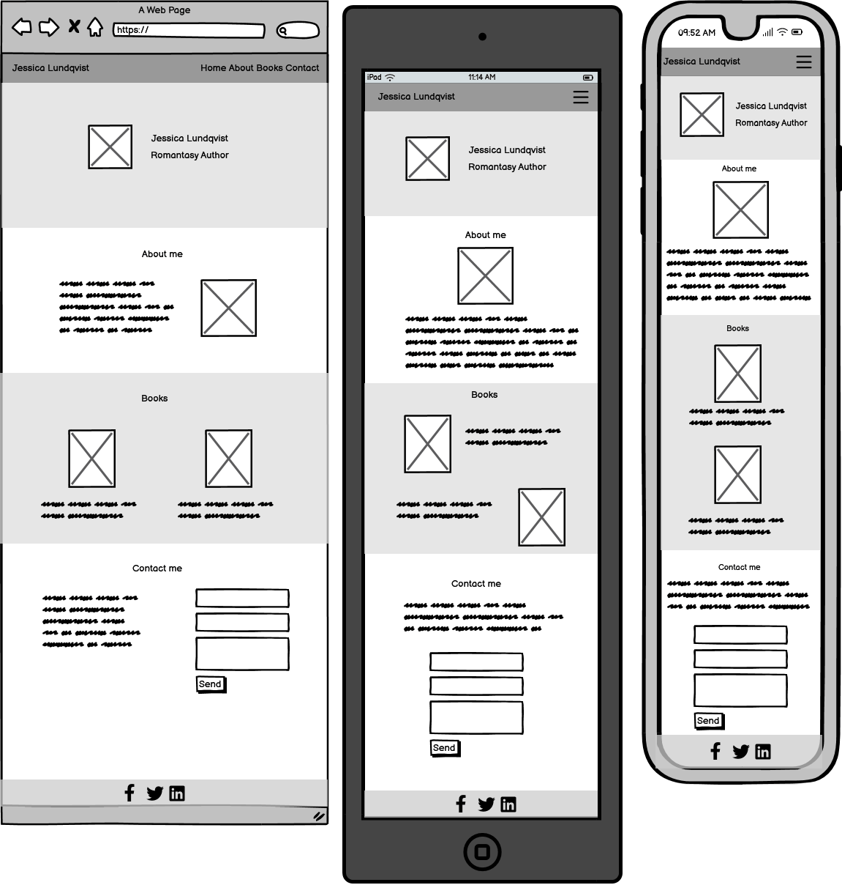
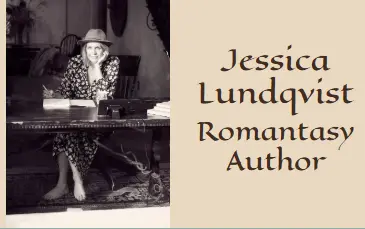
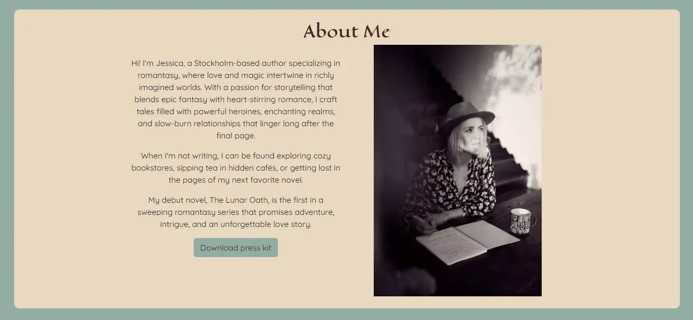
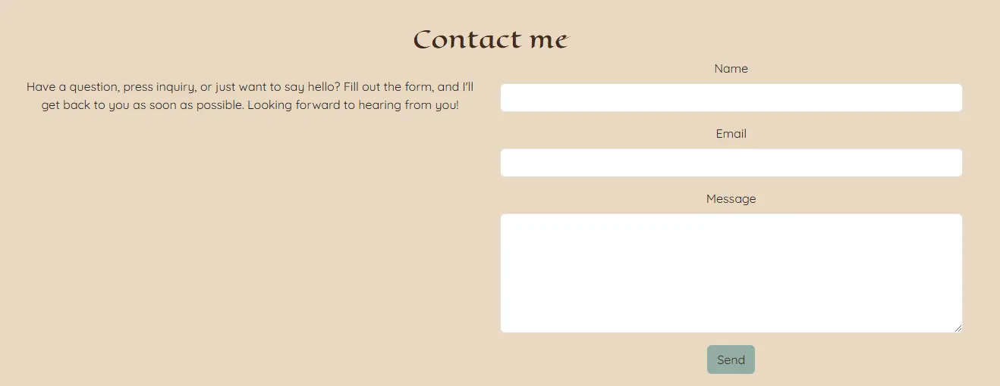
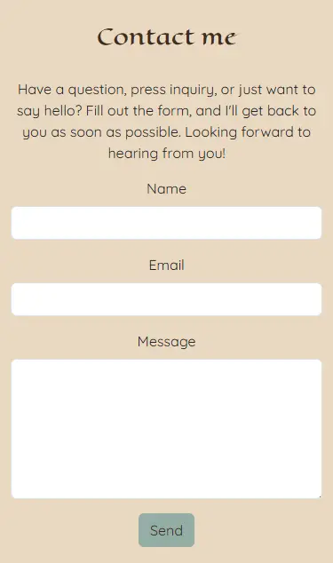
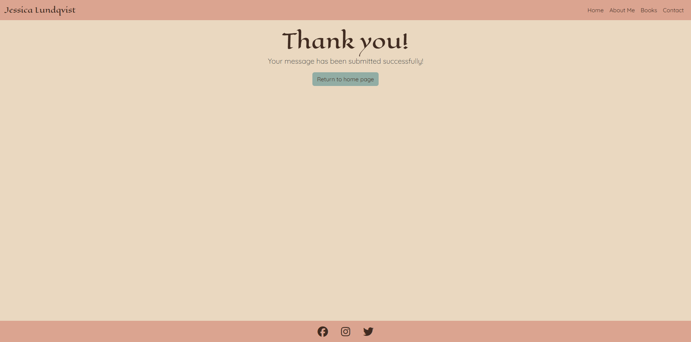
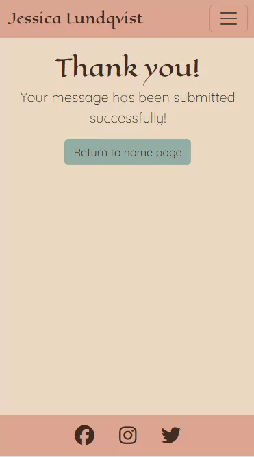
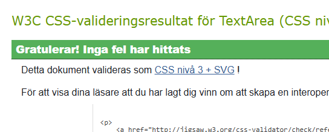
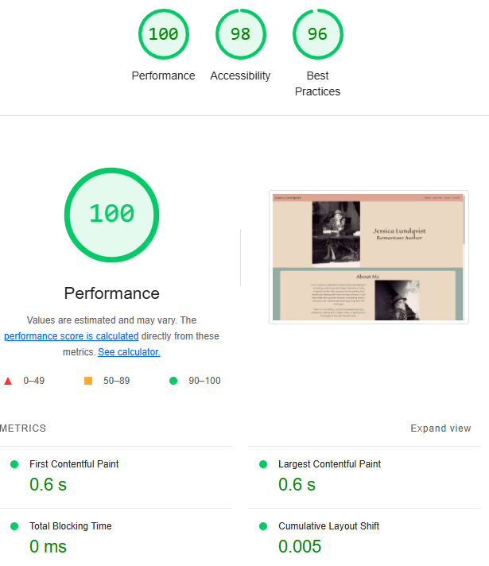

 ## Introduction

**Jessica Lundqvist Portfolio**

Link: https://fjii86.github.io/jessica-lundqvist-portfolio/

This is the portfolio of the (fictive) author Jessica Lundqvist. 

## Table of Contents

1. [Introduction](#introduction)  
2. [Goals](#goals)  
3. [UX](#ux)  
4. [Features](#features)  
5. [Technologies Used](#technologies-used)  
6. [Deployment](#deployment)  
7. [Testing](#testing)  
8. [Credits](#credits)

## Goals

### For New Visitors (Readers or Journalists)
- **Discover who Jessica is**  
  The homepage offers a welcoming introduction with a photo and short biography.
- **Learn about her books**  
  The book section contains detailed descriptions and links to buy.

### For Returning Users
- **Revisit social links or contact options**  
  The sticky navigation makes it easy to jump to relevant sections quickly.
- **Access updates or events** (future feature)  
  The structure is built to allow adding sections for upcoming events and newsletters.

### For the Website Owner (Author)
- **Showcase personality and professionalism**  
  Custom fonts, consistent styling, and responsive layout reflect Jessica’s brand.
- **Generate leads and connect with press and publishers**  
  Contact form and downloadable press kit are easy to find and use.
- **Drive book sales**  
  Book descriptions are clear and call-to-actions link directly to Amazon or similar.

## UX

### Strategy and Scope: User Expectations and User Stories 

**The Reader**

**Background**: A book lover looking to discover new authors.\
**Goals**: Learn more about the author and their books, read sample chapters, keep up with news.

**The Publishing Editor**

**Background**: Works at a publishing house, looking for new talent.\
**Goals**: Read about the author’s background, see past works, find contact details.

**The Event Organizer**

**Background**: Responsible for book fairs and literary events.\
**Goals**: Check the author’s availability for events and book them as a speaker.

**The Journalist/Blogger**

**Background**: Writes book reviews and literary articles.\
**Goals**: Find press materials and download the author's press kit.

### User Stories

**Must have**:

As a reader, I want to read about the books so that I can decide whether to buy them.

As a publishing editor, I want to see a list of the author’s works and publishing history so that I can evaluate if they are a good fit for our publishing house.

As a journalist, I want to quickly download a press kit with images and information so that I can write an article without waiting for a response.

As a reader, I want to follow the author on social media so that I can stay engaged with their latest updates.

As a journalist, I want to easily contact the author for an interview so that I can feature them in my publication.

**Should have**:

As an event organizer, I want to easily check the author's availability for lectures and events so that I can book them.

As a reader, I want to subscribe to the author’s newsletter so that I can get updates on new books and events.

**Could have**:

As an event organizer, I want to see testimonials from previous speaking engagements so that I can assess if the author is a good fit for my event.

As a book club organizer, I want to see discussion questions or reading guides so that I can plan a session around the author’s book.

### Structural

The website consists, apart from the navbar and footer, of a static page with three sections – a header, an "About Me" section, a book section, and a contact section.

The navbar links to each section and is resposive, it changes to a hamburger icon on smaller screens. The footer has links to social media sites that opens in new tabs. 

### Skeleton/Wireframes 

### Surface: Design Choices 

### Typography

I used Google Fonts Eagle Lake on the site. I chose Eagle Lake for my headings because I wanted something that connected to the fantasy genre. The font Quicksand is used for the body text making it easy to read.

### Color Scheme 

I started with a color palette I found on Pinterest that I tweaked. I played around with the placement of the colors until I felt satisfied. I adjusted the text color for better readability. 

## Features

The website start off with a navbar at the top. The left logo/name links back to the page. The links to the right links to each of the sections. It shrinks to a hamburger icon on smaller screens. 

The header features a photo and a large title. 

The about me section is framed by a container with rounded corners, giving it the same feeling as the cards and contact forms below. On smaller screen the picture goes about the text. 

The book section is made by two cards next to each other. On smaller screens they stack on top of each other. 

The contact section features a form with three fields, each one required to be filled before submitting. After submitting the user is taken to success.html. 

The footer section features Font Awesome icons with links to social media pages, that opens in a new tab. 

### Future Features

- A section or page for upcoming events.
- A form to subscribe to a newsletter.
- Reading guides or discussion questions to each book, for book clubs or classes.

## Technologies used

### Languages used:
HTML was used to design the website and CSS to style it.

### Libraries used:
Google Fonts\
Bootstrap\
Font Awesome

### Tools used:
VS Code\
Balsamiq\
Github\
[Gimp](https://www.gimp.org/) to resize the images\
[Cloud Convert](https://cloudconvert.com/) to convert images to .webp\
[Procreate](https://procreate.com/) to sketch the book covers

## Deployment

## Deployment

The site is deployed using **GitHub Pages**, a free static hosting service directly integrated into GitHub repositories.

### What is GitHub Pages?

GitHub Pages allows you to host websites straight from a GitHub repository. It’s ideal for hosting portfolios, documentation, and static websites like this one.

### Prerequisites

- A GitHub account
- A repository containing your project, committed and pushed to the `main` branch

### Deployment Steps

1. Log in to GitHub and open your repository: `jessica-lundqvist-portfolio`
2. Click on **Settings** → **Pages**
3. Under **Build and Deployment**, select:
   - Source: `Deploy from a branch`
   - Branch: `main`
   - Folder: `/ (root)`
4. Click **Save**

GitHub will build and deploy your site. You will receive a link like this:  
 [https://fjii86.github.io/jessica-lundqvist-portfolio/](https://fjii86.github.io/jessica-lundqvist-portfolio/)

### Post-deployment Notes

- Deployment may take a few minutes to appear online.
- If you make further changes, push to `main` and wait for the site to update.

## Testing

### 1. Manual Testing

All features and elements on the website were manually tested on Google Chrome and Safari, across desktop and mobile viewports.

| Feature | Expected Result | Action Taken | Actual Result |
|---|---|---|---|
| Navbar links | Scroll to correct section | Clicked “About Me” link | Page scrolled smoothly |
| Navbar collapse | Hamburger menu opens on small screens | Resized window and clicked hamburger icon | Menu appeared with links | 
| Press kit button | Opens or downloads presskit.pdf | Clicked button | File downloaded or opened | 
| Contact form | Form should submit only if all fields are filled | Tried submitting with one field empty | Blocked submission | 
| Contact form | Redirect to success.html after valid submit | Filled form and clicked "Send" | Redirected correctly | 
| Book buy buttons | Open Amazon in new tab | Clicked “Buy it here” | External page opened | 
| Responsive layout | Page reflows correctly on all screen sizes | Used Chrome dev tools and tested breakpoints | Layout adapted well | 

No issues were encountered during manual testing.

### 2. Responsive Design Testing

Responsiveness was tested using Chrome DevTools (Toggle Device Toolbar) on the following simulated devices:

- iPhone SE
- iPhone 12 Pro
- iPad Air
- Nest Hub (1024x600)
- 1920×1080 desktop

All sections adapted correctly to different screen sizes. Layout, navigation and text remained readable and visually balanced.
 

### 3. Code Validation

- [HTML Validator](https://validator.w3.org/): No issues  
  

- [CSS Validator](https://jigsaw.w3.org/css-validator/): No issues  
  

---

### 4. Lighthouse Performance Testing

Tested in Chrome DevTools → Lighthouse tab.

- No issues detected.  
- Performance, Accessibility, Best Practices and SEO all scored high.  
  

---

### 5. User Story Testing

| User Story | Tested Action | Result |
|------------|---------------|--------|
| Reader wants to read about the books | Visited Books section | OK |
| Publishing editor wants to see author's works | Read book cards and about section | OK |
| Journalist wants to download press kit | Clicked press kit button | OK |
| Reader wants to follow on social media | Clicked footer links | OK |
| Journalist wants to contact for interview | Used contact form | OK |

---

### 6. Bugs & Open Issues

**Resolved bugs:**
- Press kit button originally redirected to home – now fixed to point to PDF file.
- Minor alignment issues in book section on mobile – resolved with Bootstrap classes.

**Open bugs:**
- None found at time of submission.

## Credits

### Code

- Bootstrap 5.3 was used for navbar and responsive grids. 
- JavaScript code to ensure the Bootstrap mobile navbar collapses when navigating to in-page links, copied from the Boardwalk Games project.
- Font Awesome was used for the social media icons.
- Google Fonts was used for headings and body text.

### Media

- Photos by Darius Bashar on [unsplash.com](https://unsplash.com/@dariusbashar)

- Book cover illustrations were created by me in Procreate, inspired by fantasy book aesthetics.  

- All written content (about section, book descriptions, etc.) was written by me and is fictional material for the portfolio project.